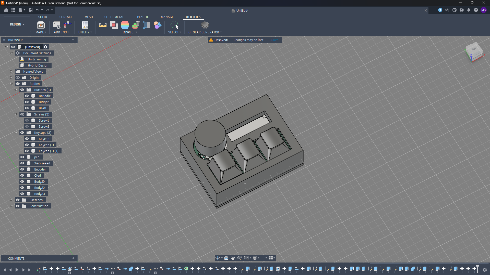
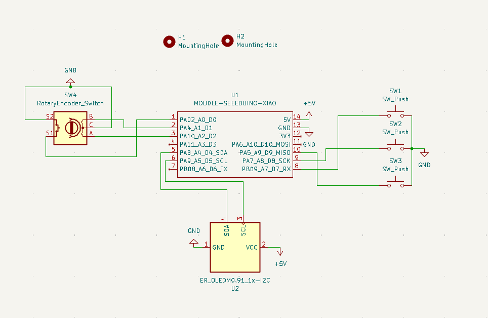
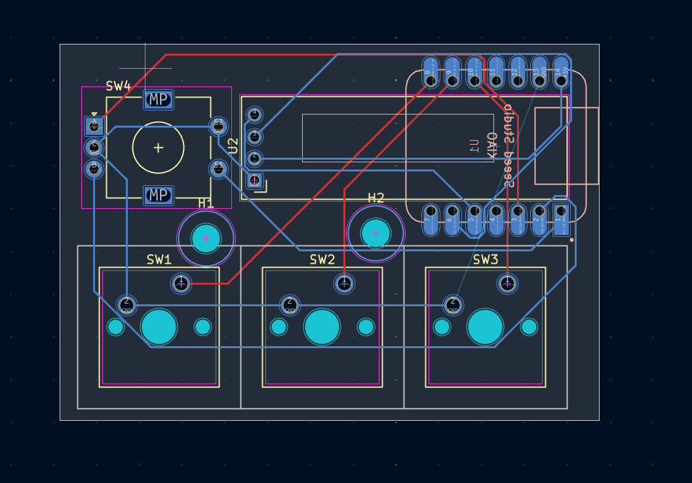

# Sketchpad
The Hackpad is a compact macro pad designed to streamline 3D modeling workflows and daily tasks. The project runs on the Seeed Studio XIAO RP2040 microcontroller and utilizes KMK Firmware built on top of CircuitPython.

The main feature of this setup is the rotary encoder logic. Instead of dedicating a physical key to switch layers, clicking the encoder freezes normal inputs and turns the knob into a manual layer selector. The user rotates the encoder to cycle through available layers on the OLED screen and clicks it again to confirm the selection.

## Key Features

* 3 independent layers (Multimedia, Cad Modeling, and Productivity).
* Encoder-based layer navigation system, saving physical buttons for actual shortcuts.
* 0.91-inch OLED display providing immediate visual feedback of the active mode.
* Open-source code using KMK, allowing quick modifications without needing to compile firmware.

## PCB Design

The custom PCB was developed using KiCad. It utilizes direct routing to the XIAO breakout pins to avoid the necessity of a diode matrix for this layout footprint. The keyswitch footprints use the standard MX_V2 specifications, allowing compatibility with most mechanical switches. 

The custom decorative silkscreen on the board layout was designed externally and imported directly from a Figma image export.

* Layer Configuration (Keymap)
  
Layer 1: General / Multimedia
Focused on navigation and media control for daily OS use.
Button 1: Mute
Button 2: Previous track
Button 3: Next track
Encoder: Global volume control

Layer 2: Fusion 360 & 3D Sketching
Shortcuts mapped specifically for 3D modeling workflows.
Button 1: 3D Orbit (Shift + F)
Button 2: Shortcut S (Fusion command search menu)
Button 3: Shortcut E (Extrude)
Encoder: Zoom In / Zoom Out (Mouse scroll)

Layer 3: Productivity / Editing
Quick actions for text and code editing.
Button 1: Ctrl + Z
Button 2: Ctrl + X
Button 3: Ctrl + V
Encoder: Line navigation (Arrow Up / Arrow Down)
